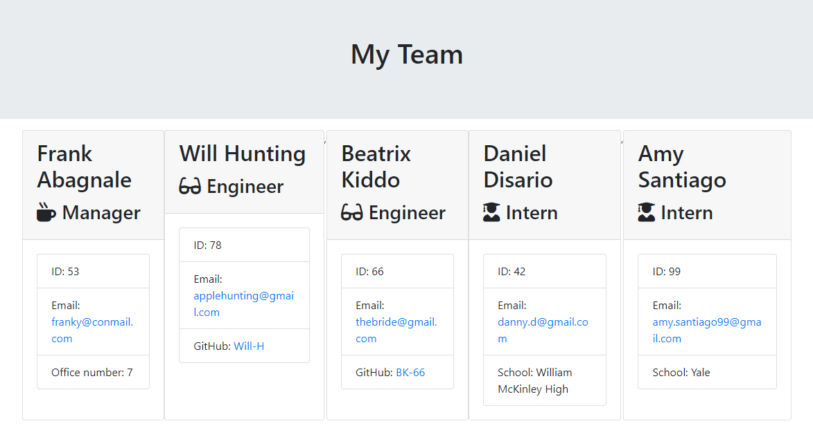

# Team Profile Generator

## Description
A command line application built using node.js to generate a team profile for an engineering team.   

[Video showing the application from the user's perspective](https://vimeo.com/441614688)

## Table of Contents
1. [Installation](#Installation)
2. [Usage](#Usage)
3. [License](#License)
4. [Contribution](#Contribution)
5. [Questions](#Questions)

## Installation
Clone the repository to your drive and run `npm install` to install enquirer.

## Usage
Use `node app.js` to run the application. First fill in the Manager's details, then add Engineers or Interns one by one. There is no limit to the amount of Engineers or Interns you can add. Once you have entered all the members from your team, select Generate Profile option to generate the html file showing your team profile.

## License
MIT  
 

## Contribution
This was a solo project not open to contributions.

## Tests
Use `npm run test` to test the application with Jest.

## Questions
You can view my GitHub profile here: https://github.com/CR-53 
If you have any questions, feel free to send me an email: chrisroschi53@gmail.com
